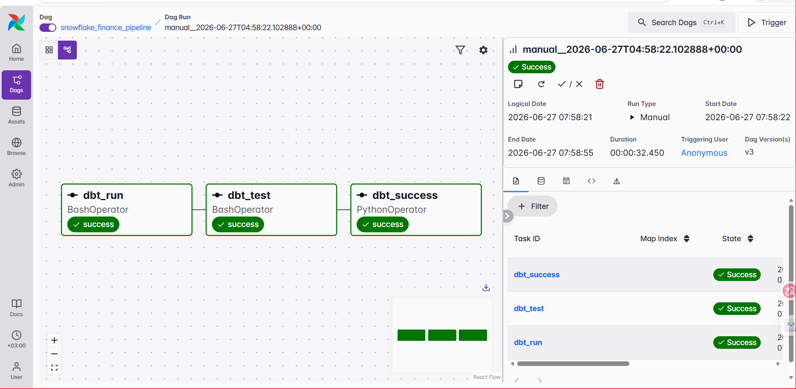
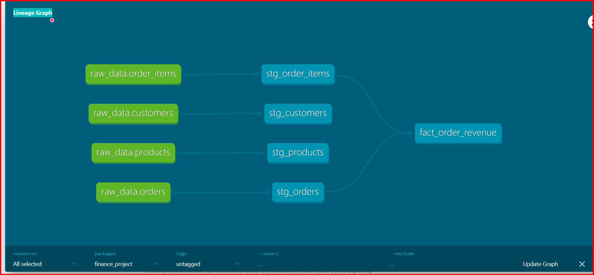
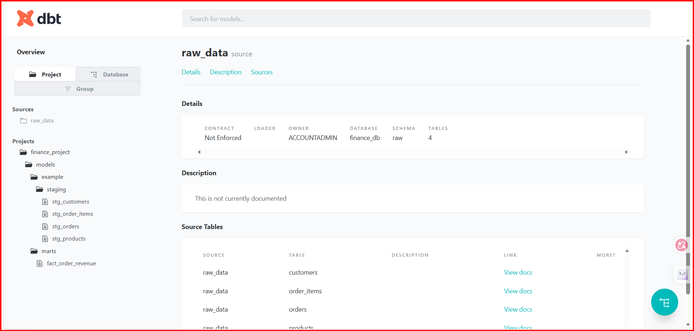
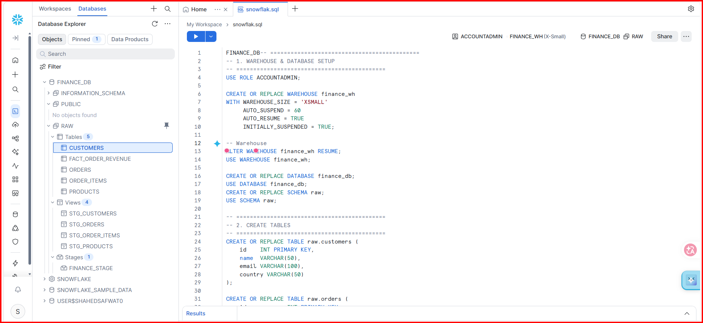

# 🛒 Retail Data Pipeline | Airflow + dbt + Snowflake

An end-to-end data engineering pipeline built for a retail dataset, using **Apache Airflow** for orchestration, **dbt Core** for transformations, and **Snowflake** as the cloud data warehouse.

---

## 📐 Architecture

```
CSV Files
    │
    ▼
Snowflake Raw Layer
    │
    ▼
dbt Transformations
    │
    ▼
Snowflake Analytics Layer
    │
    ▼
Airflow DAG Orchestration
```

---

## 📦 Dataset

The project uses retail data containing:

| Entity | Description |
|---|---|
| `customers` | Customer profile information |
| `products` | Product catalog |
| `orders` | Order header records |
| `order_items` | Line-level order details |

---

## 🛠️ Technologies

| Tool | Purpose |
|---|---|
| Apache Airflow | Pipeline orchestration |
| Astronomer CLI | Local Airflow environment |
| dbt Core | SQL transformations |
| dbt Snowflake Adapter | Snowflake connectivity for dbt |
| Snowflake | Cloud data warehouse |
| Docker | Containerized development |
| Python | DAG scripting |
| SQL | Data modeling |

---

## 📁 Project Structure

```
Retail/
│
├── dags/
│   └── finance_pipeline.py       # Airflow DAG definition
│
├── finance_snowflake/            # dbt project
│   ├── models/
│   │   ├── staging/              # Staging layer views
│   │   └── marts/                # Analytical fact models
│   ├── dbt_project.yml
│   └── profiles.yml
│
├── include/                      # Raw CSV source files
│   ├── customers.csv
│   ├── products.csv
│   ├── orders.csv
│   └── order_items.csv
│
├── Dockerfile
├── requirements.txt
└── packages.txt
```

---

## ⚙️ Airflow Pipeline

The DAG orchestrates the full dbt workflow in three steps:

```
dbt run
   │
   ▼
dbt test
   │
   ▼
Success Task ✅
```

**What the DAG does:**
1. Executes all dbt models against Snowflake
2. Validates transformed data using dbt tests
3. Marks the pipeline as successfully complete

---

## 🔄 dbt Transformations

### Staging Models (Views)

| Model | Source Table |
|---|---|
| `stg_customers` | Raw customers |
| `stg_products` | Raw products |
| `stg_orders` | Raw orders |
| `stg_order_items` | Raw order items |

### Fact Model (Table)

| Model | Description |
|---|---|
| `fact_order_revenue` | Joins orders and order items to calculate revenue metrics |

---

## ❄️ Snowflake Configuration

The project connects to Snowflake using the dbt Snowflake adapter with the following setup:

- **Database** — target analytics database
- **Warehouse** — compute warehouse for query execution
- **Schema** — target schema for dbt models
- **Role** — access role for permissions

---

## 🚀 Running the Project Locally

### 1. Start Airflow

```bash
astro dev start
```

Access the Airflow UI at:

```
http://localhost:8080
```

### 2. Run dbt Manually

Navigate into the dbt project:

```bash
cd finance_snowflake
```

Run all models:

```bash
dbt run
```

Run data quality tests:

```bash
dbt test
```

---

## 🐳 Docker Services

The project spins up the following containers:

| Container | Role |
|---|---|
| Airflow Scheduler | Triggers and schedules DAG runs |
| Airflow API Server | Hosts the Airflow web UI |
| Airflow Triggerer | Handles deferred tasks |
| DAG Processor | Parses and registers DAG files |
| PostgreSQL | Airflow metadata database |

---

## 📸 Screenshots

### Airflow DAG


### dbt Lineage Graph


### dbt Project


### Snowflake


---

## ✅ Key Features

- Automated pipeline orchestration with Airflow
- Cloud data warehouse integration via Snowflake
- Modular SQL transformations using dbt
- Built-in data quality testing
- Reproducible local development environment using Docker

---

## 👩‍💻 Author

**Shahd Safwat**  
